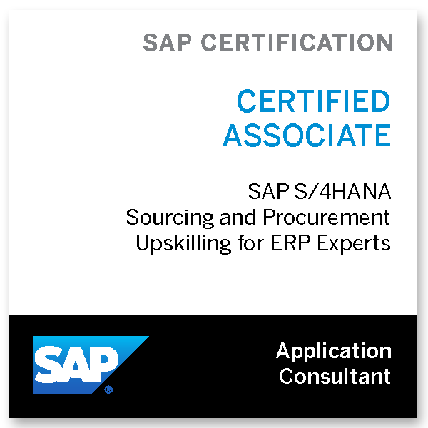
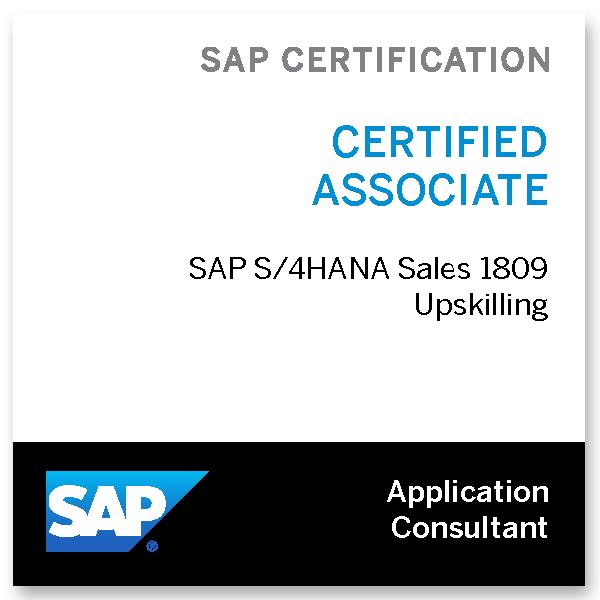

# Mika Wada   Data Analytics&nbsp;&nbsp;|&nbsp;&nbsp;Cloud&nbsp;&nbsp;|&nbsp;&nbsp;Cybersecurity

## Technical Skills
- Programming & Databases: **Python, R, SQL, Streamlit, MongoDB**
- Business Intelligence: **Tableau, Power BI**
- Cloud (AWS): **EC2, Lambda, EventBridge, S3, RDS, DynamoDB, QuickSight, CloudShell, IAM, VPC**
- ERP: **SAP S/4 HANA**

## AWS Projects
- [AWS-Hosted Streamlit Dashboard (Services: S3, Lambda, EventBridge, RDS, DynamoDB, EC2, VPC)](https://github.com/mikawada/aws-streamlit)
- [Visualizing Data with Amazon QuickSight (Services: S3, QuickSight)](https://github.com/mikawada/analytics-quicksight)
- [Loading and Querying Data in DynamoDB (Services: DynamoDB, CLI, CloudShell)](https://github.com/mikawada/databases-dynamodb)
- [Building a Game with a Continuous Deployment Pipeline from GitHub to S3 (Services: CodePipeline, S3)](https://github.com/mikawada/codepipeline-s3-game)

## Other Technical Projects
- [ETL Movie-Soundtrack Analysis (Tools: PySpark, MongoDB, Streamlit)](https://github.com/mikawada/etl-movie-soundtrack)
- [Ad CTR Predictive Modeling (Tools: R)]

## Certifications
- AWS Certified Cloud Practitioner
- Google Cybersecurity Certificate
- SAP S/4 HANA Sourcing and Procurement
- SAP S/4 HANA Sales 1809 Upskilling

[][CCP]
[][GC]
[][SAP1]
[][SAP2]

[CCP]: https://www.credly.com/badges/05191195-e16c-47f4-99d9-dfeb0980fe3e
[GC]: https://www.credly.com/badges/a5e1683f-5bc9-4e2f-8465-e0414889303a
[SAP1]: https://www.credly.com/badges/ff4050a9-1fe3-451a-aee2-8bfe1199bc79
[SAP2]: https://www.credly.com/badges/980adb89-47af-4421-9d51-3da48d3c9425

🛠️ Currently working on...
- CompTIA Security+
- AWS Certified Solutions Architect Associate

## Education						       		
- M.S., Applied Analytics	| Columbia University (_Expected: August 2025 - New York, USA_)	 			        		
- B.A., Policy Management & Economics | Keio University (_September 2019 - Tokyo, Japan_)

## Professional Experience
**Consultant | Deloitte Tohmatsu Consulting LLC (_February 2021 - April 2023_)**
  - Key Projects: Intranet renewal and brand restructuring, DEI strategy development

**Business Analyst | Deloitte Tohmatsu Consulting LLC (_October 2019 - January 2021_)**
  - Key Projects: Business process transformation, SAP S/4 HANA implementation

**Publisher Engagement Intern | Anymind Group (_October 2017 - June 2019_)**

## Connect with me:

[][linkedin]

[linkedin]: https://www.linkedin.com/in/mika-tina-wada/
